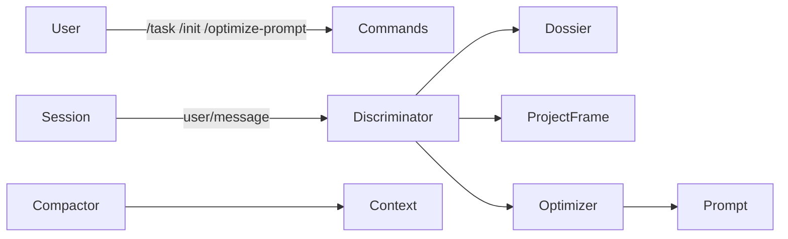

# dsh-context-economy

> DeepSeek Harness 的上下文管理插件：任务边界、项目帧、自动判别与上下文优化。
>
> 非官方项目 · 开发态（R2 判别域进行中）

[](LICENSE)
[]()
[]()

## 这是什么

`dsh-context-economy` 是一个面向 DeepSeek Harness 的上下文管理插件，目标是把“送进模型的每个 token”花在更重要的地方：

- 显式任务边界
- 项目帧初始化
- 自动判别任务延续 / 切换
- 手动断面入口
- 可回放、可降级的会话事实

当前已完成平台面与判别域主体骨架，星标 UI 与 host 方法仍在施工中。

## 核心特性

- **任务边界**：`/task`、`/task close`，Tier-0 权威边界
- **项目帧**：`/init` 提案 → 用户确认 → `project_frame` v1
- **自动判别**：T0 → L0 → 对表 → LLM → fail-lazy 决策链
- **手动断面**：`/optimize-prompt` 命令入口，后续与星标按钮共用
- **事实可回放**：`context-economy/*` 事件全部 log-only + ignorable
- **降级安全**：harness 无 ignorable 通道时自动降级 KV 镜像

## 架构图



分层的工程结构：

```text
src/
├─ platform/    # harness 适配层，唯一外部触点
├─ core/        # 纯逻辑，零 harness import
├─ domains/     # 命令面、自动断面等编排
└─ index.ts     # 插件入口
client/         # 设置卡、星标按钮 UI
docs/           # 设计正典与施工工单
```

## 安装

> 当前为开发态，尚未发布 npm 包。以下方式面向本地开发与测试。

```bash
# 1. 安装依赖
npm install --legacy-peer-deps --ignore-scripts --no-audit --no-fund --no-package-lock

# 2. 构建（需要本机 DSH source checkout）
DSH_CHECKOUT=/path/to/deepseek-harness npm run build

# 3. 注入到 DSH 实例
dev_inject_plugin /path/to/dsh-context-economy
```

后续发布形态计划：

- npm 包：`dsh plugin add dsh-context-economy`
- tarball：`dsh plugin add ./dsh-context-economy-0.0.1.tgz`

## 快速开始

```text
/init 我要做一个上下文管理插件
/init confirm

/task 设计命令面
/task
/task close
```

## 配置

当前配置集中在 `discriminator` 命名空间。

| 配置 | 类型 | 默认值 | 说明 |
|---|---|---|---|
| `discriminator.auto` | boolean | `false` | 自动断面总开关 |
| `discriminator.provider` | string | `deepseek-official` | 辅助 LLM provider |
| `discriminator.model` | string | `deepseek-v4-flash-vision-exp` | 辅助 LLM 模型 |

## 命令

| 命令 | 作用 |
|---|---|
| `/task <描述>` | 显式开启新任务 |
| `/task close` | 显式闭合当前任务 |
| `/task` | 查看当前任务状态 |
| `/init <项目目标>` | 发起项目帧初始化提案 |
| `/init confirm` | 确认并写入项目帧 v1 |
| `/init cancel` | 取消当前提案 |
| `/init` | 查看当前项目帧 |
| `/optimize-prompt` | 手动断面入口（P14b 接入后开放） |

## 会话事实

所有自定义事件均为 log-only，带 `ignorable: true`。

| 事件 | 含义 |
|---|---|
| `context-economy/task-boundary` | 任务边界事实 |
| `context-economy/judge-recorded` | 自动判别记录 |
| `context-economy/judge-error` | 判别失败记录 |
| `context-economy/judge-verdict` | 新任务判定 |

## 文档

- [docs/00-overview.md](docs/00-overview.md) —— 系统导览与公共契约
- [docs/01-architecture.md](docs/01-architecture.md) —— 架构总纲
- [docs/02-discriminator.md](docs/02-discriminator.md) —— 优化判别器
- [docs/03-shear.md](docs/03-shear.md) —— 剪切层
- [docs/04-compactor.md](docs/04-compactor.md) —— 压缩器
- [docs/05-constitution.md](docs/05-constitution.md) —— 宪法与守卫
- [docs/09-state.md](docs/09-state.md) —— 状态与版本协议
- [docs/10-wiring.md](docs/10-wiring.md) —— 挂点与接线
- [docs/11-structure.md](docs/11-structure.md) —— 工程结构
- [docs/12-platform-capabilities.md](docs/12-platform-capabilities.md) —— 平台能力契约
- [docs/implement/00-master.md](docs/implement/00-master.md) —— 施工总纲

## 开发

```bash
# 类型检查 + 测试 + 结构断言
npm run gate

# 测试类型检查
npm run typecheck:tests

# 单工单验收
node scripts/verify-p13.mjs
```

核心纪律：

- `core/` 零 harness import
- `context-economy/*` 事件必须 `ignorable: true`
- 改史唯一通道：`session.append` + `surfaceOp replace`
- LLM 产物先版本化落盘再复用

## 兼容性

- 验证基于 DSH harness checkout `ea04b581a5`
- peer dependency 范围见 `package.json`
- 依赖 harness ignorable 会话事实通道
- 通道缺失时降级为 KV 事实镜像，行为仍安全

## 已知限制 / 开发路线

### 当前未完成

- 尚未发布 npm / tarball
- P14a 星标按钮 UI 未接入
- P14b host 方法与断面回填未接入
- R3 剪切域、R4 压缩域尚未实现
- 构建依赖本地 DSH source checkout，尚未提供自包含 `prepare`

### Roadmap

| 阶段 | 内容 | 状态 |
|---|---|---|
| R1 | 平台面：事件、存储、技能、LLM、历史、工具 | 已完成 |
| R2 | 判别域：任务边界、项目帧、自动/手动断面 | 进行中 |
| R3 | 剪切域 | 未开始 |
| R4 | 压缩域 | 未开始 |

## 贡献

欢迎提交 Issue 和 PR。提交前请确保：

```bash
npm run gate
```

全绿。

## License

[BSD-3-Clause](LICENSE)

> 本项目与 DeepSeek 官方无隶属关系。
