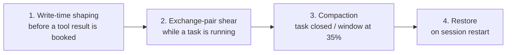

<div align="center">


# dsh-price-less

**Context management plugin for DeepSeek Harness**

> **Priceless thoughts. Price-less costs.**

[](LICENSE)
[]()
[]()
[]()

[English](./README.md) · [中文](./README.zh-CN.md)

</div>

---

## Table of Contents

- [About The Project](#about-the-project)
- [How It Works](#how-it-works)
- [Current Status](#current-status)
- [Features](#features)
- [Architecture](#architecture)
  - [Layers at a Glance](#layers-at-a-glance)
  - [Key Mechanisms & Field Fixes](#key-mechanisms--field-fixes)
- [Getting Started](#getting-started)
  - [Prerequisites](#prerequisites)
  - [Source Installation](#source-installation)
- [Usage](#usage)
- [Configuration](#configuration)
- [Commands](#commands)
- [Session Events](#session-events)
- [Documentation](#documentation)
- [Roadmap](#roadmap)
- [Known Limitations](#known-limitations)
- [Contributing](#contributing)
- [License](#license)
- [Acknowledgments](#acknowledgments)

## About The Project

Long AI-coding sessions get expensive — and drift. `dsh-price-less` is an unofficial **context steward** for DeepSeek Harness: it tracks what you are working on, keeps the context sent to the model lean, and never touches anything it isn't sure about — so every token you send earns its place.

- **Explicit tasks**: `/task` marks what you are working on; opening and closing tasks is always your call
- **Project brief (project frame)**: `/init` asks a few questions and persists a project brief, so the model always knows what this project is
- **Intent detection**: decides whether each message continues the current task or starts a new one — keyword rules first, a light auxiliary model only when unsure
- **Star button / prompt optimizer**: one click folds the current intent into a deterministic execution package, previewed and confirmed by you
- **Tool shear**: slims tool output at write time, drops reads superseded by a later write, and flushes finished question/verification runs
- **Compaction**: folds closed tasks into a versioned archive with a hot tail, a 35%-of-window pressure path, and an overflow fuse
- **Log-only & replayable**: every plugin action leaves a replayable fact log; on any failure it changes nothing — your content is never lost

## How It Works

One sentence: **you just say what you are working on; the plugin keeps the context lean, and never touches anything it isn't sure about.**

Four defence layers fire in order, from earliest to latest:



| Layer | When it fires | What it touches | What it never touches |
|---|---|---|---|
| 1. Write-time shaping | **before** a tool result is booked | process logs only (≥120 lines and ≥16 KiB) | failures, listings, data queries stay verbatim |
| 2. Exchange-pair shear | while a task is running | reads superseded by a later write, declaration reads, finished question/verify runs | conclusions land as a notice — the original is not lost |
| 3. Compaction | task closes, or the main-model window hits 35% | folds old content into "archive (digest) + hot tail (recent verbatim facts)" | errors never enter the hot tail; the archive stores digests; a hot-tail entry gets a "path@version:lines" locator only when its content cannot locate itself |
| 4. Restore | session restart / resume | replays dossier and archive, recomputes state with pure functions | no model calls, no history edits, degrade only — never invent |

Three rules hold across all four layers:

- **Failure means keep**: if the criteria don't hold, parsing fails, or a call times out — no cut, no replace, no backfill.
- **Cut points are fixed before a result is booked**: no dependence on model replies, no behavioural signals (they break the cache and cost more).
- **Out-of-band**: plugin-internal flags never enter the model's view; the model only sees the tidied content.

> To see what each action cost, read `logs/context-economy.log`; for the historical account, see [`docs/ledger-history.md`](docs/ledger-history.md).

## Current Status

| Area | Status |
|---|---|
| R1 platform foundation (events, storage, skills, LLM, history, tools) | Completed |
| R2 detection & optimizer core (P8–P14d: task boundaries, project frame, intent detection, prompt optimizer, star button) | Completed |
| R3 shear (write-time shaping, T0/T0-R, run flush) | Completed |
| R4 compaction (boundary assembler, hot tail, pressure path, fuse, restore) | Completed |
| New-build activation | Requires a DSH restart to load the rebuilt `lib/` |
| npm/tarball distribution | Not published yet |

> **Important**: automatic intent detection is **off by default** — enable it explicitly with `discriminator.auto = true`. Tool shear (`shear.enabled`) and both compaction paths default to on. All facts are log-only; any failure changes nothing.

## Features

- **Task boundaries**: `/task`, `/task close`, `/task` — split continuous work into clearly bounded tasks
- **Project brief**: `/init` proposal → your confirmation → persisted as project brief v1 (`project_frame`)
- **Intent detection**: explicit instruction → zero-cost keyword rules → past verdicts → light-model fallback; anything unresolved stays untouched (fail-lazy)
- **Prompt optimizer + star button**: `/optimize-prompt` and the star button share one section; output = verbatim key facts plus a rewritten execution package, previewed before it is applied
- **Tool shear**: write-time shaping (process logs only), superseded reads, declaration-table repair, and run flush for finished question/verification runs
- **Compaction**: task-boundary folding into a versioned archive + hot tail; 35%-of-window pressure path; overflow fuse; restore on session start
- **Workspace isolation**: archive/prefix keys are scoped by the session workspace (`header.cwd`)
- **Log-only & replayable**: all `context-economy/*` events are log-only and `ignorable`; if the channel is missing, facts degrade to a KV mirror

## Architecture


> Source = [`docs/architecture.svg`](docs/architecture.svg) (Chinese version [`architecture.zh-CN.svg`](docs/architecture.zh-CN.svg)). Solid = implemented; dashed = pending validation. Each box is annotated with the field-fix ids that shaped it.

### Layers at a Glance

Top to bottom is the data flow; bottom to top is the "who obeys whom" constraint:

| Layer | Plain language | Canonical term | Rule |
|---|---|---|---|
| Top | you and the harness | host | the event stream enters the plugin from the session |
| `domains/` | decides **what to do** | orchestration | commands, intent detection, shear/compaction/restore wiring |
| `core/` | decides **how to compute** | pure kernel | **zero harness imports**, computation only, unit-testable |
| `platform/` | decides **how to connect** | adapter | the only harness touchpoint (H1–H15); swapping hosts touches this layer only |
| Bottom | what is left behind | data / facts | durable KV + session facts + diagnostics, all replayable |

```text
src/
├─ platform/    # adapter layer — the plugin's only way to touch the harness
├─ core/        # pure logic — computation only, zero harness imports
├─ domains/     # orchestration — commands, intent detection, wiring
├─ config.ts    # config schema and defaults
├─ settings.ts  # settings UI wiring
└─ index.ts     # plugin entry
client/         # settings card and star-button UI
docs/           # design canon and work orders
```

### Key Mechanisms & Field Fixes

Every item below is landed in code and recorded in the ledger; the diagram annotates them next to the mechanism they belong to:

| Fix | What it is | Ledger |
|---|---|---|
| F1 | The tools port must go through `ctx.inject(['tools'])`; otherwise shear idles entirely | §60 |
| F2 | A 60 s verdict barrier before boundary compaction, so a new task doesn't start carrying the old task's context | §60 |
| F3 | Workspace isolation: archive/prefix keys are keyed by the session `header.cwd` | §70 |
| F4 / F5a | Diagnostics-log dedup; archive rendering leads with the conclusion plus type labels | §60 |
| F8a / F8b | Estimator aligned with DSH `token-meter`; two-bucket density (CJK 1.5 / other 2.9 chars per token) | §61 |
| F9a–F9g | Authoritative-surface ranges, product schema v2, hot-tail fact carrier, dual budget 10K/10K, relative paths | §62–§68 |
| F10 | Contract v3: digest has zero pointers, hot tail points at the archive, archive stores digests only, errors excluded | §69 |
| F11 | Listing commands (`Get-ChildItem` / `ls` / `dir` …) are never sheared | §70 |
| F12 | Shadow mode is zero-byte: it records facts and never writes notes into content | §70 |
| F13 | Discriminator v4: a task is sustained improvement on the same work object / similar goal; sub-tasks do not split it | §70 |
| F14 | Hot-tail locator on demand (path added only when the content cannot locate itself) plus locatability / extra-search ledger | §79 |
| P14c / P14d | Discriminator-chain slimming; star-section product contract (verbatim key facts + bold rewrite, no labels, second click only re-opens) | §33 / §35–§37 |
| P17c | Assembler HT soft gate + discard attribution | §44 |
| P20c | Pressure valve = `pressureRatio` (0.35) × main-model window; no window → 125K → safety net 100K | §48 |
| W2 | T-entry admission tightened to a process-log allowlist; failures / listings / data queries stay verbatim | §73 |
| N series / T-loop | Negotiation shear and post-tool reasoning truncation **retired** (0 hits in the field / cache breakage) | §71 / §72 |

## Getting Started

### Prerequisites

- Node.js with ESM support (Node 20+ recommended)
- A local DeepSeek Harness source checkout for building
- `dsh` CLI or `dev_inject_plugin` for loading the plugin

Host version: the `peerDependencies` range accepts both the patched
`0.1.3-alpha.*` line and prerelease `0.1.5-*` hosts
(`>=0.1.3-alpha.1 <2 || >=0.1.5-alpha.0 <2`). Two caveats, both verified on the
harness source (2026-09-10):

- The **ignorable write channel** (`SESSION_LOG_INTENT` / `LogIntent`) is a local
  harness patch that has **not** reached upstream. On a vanilla host the fact
  track degrades to the KV mirror; the ledger semantics are unchanged
  ([`docs/12 §3`](docs/12-platform-capabilities.md)).
- Upstream `0.1.5` renamed the replace `surfaceOp` endpoints
  (`{start,end}` → `{startSeq,endSeq}`) and bumped the session format to v3.
  `src/platform/history.ts` carries a compile-time anchor for exactly this drift:
  targeting such a host turns that anchor **red on purpose**. Do not silence it —
  change the one `REPLACE_OP_KEYS` constant next to it
  ([`docs/implement/REPAIR-2026-09-10.md §8`](docs/implement/REPAIR-2026-09-10.md)).

### Source Installation

This is currently a **source-build / developer installation**. There is no published npm package or tarball distribution yet.

```bash
# 1. Install dependencies
npm install --legacy-peer-deps --ignore-scripts --no-audit --no-fund --no-package-lock

# 2. Build from source (requires a local DSH checkout)
DSH_CHECKOUT=/path/to/deepseek-harness npm run build

# 3. Inject into a DSH instance
dev_inject_plugin /path/to/dsh-price-less
```

Planned distribution forms (not available yet):

- npm: `dsh plugin add dsh-price-less`
- tarball: `dsh plugin add ./dsh-price-less-0.0.1.tgz`

## Usage

```text
/init I am building a context management plugin
/init confirm

/task Design the command face
/task
/task close

/optimize-prompt
```

- `/init` is only a proposal; `/init confirm` persists the brief. Cancel any time with `/init cancel`.
- `/task` opens a new task; later messages are classified as continuation or new task by intent detection (when enabled); `/task close` marks the end, which is what triggers boundary compaction.
- `/optimize-prompt` or the star button opens a preview first: it applies only after you confirm, and your edited version is final.
- Any step can fail without changing anything — the worst case is that nothing happened.

## Configuration

Configuration is grouped under `shear` (tool shear), `compression` (compaction) and `discriminator` (intent detection / auxiliary model). Use the GUI settings card, or write `~/.dsh/settings.yaml` directly:

```yaml
context-economy:
  shear:
    enabled: true
  compression:
    boundary: true
    pressure: true
    pressureRatio: 0.35      # pressure valve = ratio × main-model context window
    domainTokens: 125000     # assumed window when the main model declares none
    retainTokens: 10000      # hot-tail budget
    thresholdTokens: 100000  # absolute safety net
    archiveCapTokens: 10000  # archive hard cap (digest only)
  discriminator:
    auto: false              # intent detection is off by default
    # provider: deepseek-official
    # model: deepseek-v4.1-flash-expires-on-0910
    # reasoningEffort: high
```

| Key | Type | Default | Description |
|---|---|---|---|
| `shear.enabled` | boolean | `true` | Tool-shear master switch |
| `compression.boundary` | boolean | `true` | Task-boundary compaction |
| `compression.pressure` | boolean | `true` | Pressure-path compaction |
| `compression.pressureRatio` | number | `0.35` | Pressure valve = ratio × main-model context window |
| `compression.domainTokens` | number | `125000` | Assumed window when the main model declares none |
| `compression.retainTokens` | number | `10000` | Hot-tail budget |
| `compression.thresholdTokens` | number | `100000` | Absolute safety net |
| `compression.archiveCapTokens` | number | `10000` | Archive hard cap (digest only) |
| `discriminator.auto` | boolean | `false` | Automatic intent-detection master switch |
| `discriminator.provider` / `model` | string | unset | Auxiliary LLM route; set both to override, empty = follow the session model |
| `discriminator.reasoningEffort` | string | unset | Auxiliary reasoning effort; unset = follow the model default |

> The schema declares no default for `provider`/`model`. Left empty, auxiliary calls (intent detection, `/init`, star section, boundary compaction) first **follow the current session model** (provider/model of the latest request), falling back to the built-in default `deepseek-official` / `deepseek-v4.1-flash-expires-on-0910` when the session has no request yet; setting **both** values overrides it. Enabling `discriminator.auto` or using `/init`, the star button, or boundary compaction may invoke the auxiliary LLM. This can incur API costs and may send relevant prompt content to the configured provider.

## Commands

| Command | Purpose |
|---|---|
| `/task <description>` | Explicitly open a new task |
| `/task close` | Close the current task |
| `/task` | Show current task status |
| `/init <goal>` | Start a project brief proposal |
| `/init confirm` | Confirm and persist the project brief v1 (`project_frame`) |
| `/init cancel` | Cancel the current proposal |
| `/init` | Show the current project brief |
| `/optimize-prompt` | Command-form prompt optimizer entry (the star button is the primary UI) |

## Session Events

All custom events are log-only and carry `ignorable: true`.

| Event | Meaning |
|---|---|
| `context-economy/task-boundary` | Task boundary fact (which task opened / closed) |
| `context-economy/judge-recorded` / `judge-error` / `judge-verdict` | Intent-detection records and verdict |
| `context-economy/optimize-run` | Star-section full account |
| `context-economy/shear-applied` / `shear-decision` / `shear-error` / `shear-run-plan` | Shear actions, decisions, errors, star run plans |
| `context-economy/assemble-run` | Boundary assembly account |
| `context-economy/compress-run` | Compression-call account |
| `context-economy/pressure-fired` / `hard-truncate` | Pressure trigger / overflow fuse |
| `context-economy/restore-step` / `restore-degraded` / `restore-done` | Restore ordering on session start |

## Documentation

The design canon is maintained under [`docs/`](docs/):

- [00 · System overview](docs/00-overview.md)
- [01 · Architecture](docs/01-architecture.md)
- [02 · Discriminator](docs/02-discriminator.md)
- [03 · Shear](docs/03-shear.md)
- [04 · Compactor](docs/04-compactor.md)
- [05 · Constitution](docs/05-constitution.md)
- [06 · Cache](docs/06-cache.md)
- [07 · Metrics](docs/07-metrics.md)
- [08 · Experiment protocol (sealed)](docs/08-experiment.md)
- [09 · State](docs/09-state.md)
- [10 · Wiring](docs/10-wiring.md)
- [11 · Structure](docs/11-structure.md)
- [12 · Platform capabilities](docs/12-platform-capabilities.md)
- [13 · Harness plugin spec](docs/13-harness-plugin-spec.md)
- [legacy · Retired designs](docs/legacy.md)
- [TODO · Pending directions](docs/implement/TODO.md)
- [ledger-history · Snapshot archive](docs/ledger-history.md)

> Inside `docs/implement/archive/`, the R1–R4 work orders and the remaining retired docs are **local-only** (excluded by `.gitignore`; the full text remains in git history). Two research records are tracked: the [W2c output-shape evaluation](docs/implement/archive/W2c-output-shape.md) and the [N-series master](docs/implement/archive/00-master-N-series.md).

## Roadmap

| Phase | Scope | Status |
|---|---|---|
| R1 | Platform foundation: events, storage, skills, LLM, history, tools | Completed |
| R2 | Detection & optimizer: task boundaries, project brief, intent detection, prompt optimizer, star button | Completed |
| R3 | Shear: slim tool results, superseded reads, run flush | Completed |
| R4 | Compaction: boundary assembler, pressure path, fuse, restore | Completed |
| B series | Branch/merge context (checkout/merge) — space for efficiency | Pending validation — [TODO §3](docs/implement/TODO.md) |
| R series | Reasoning-replay stripping | Pending validation — [TODO §3](docs/implement/TODO.md) |

## Known Limitations

- **Not published**: the package is still marked `private` and there is no official npm/tarball release.
- **A rebuilt `lib/` needs a DSH restart**: mechanisms load on the next restart.
- **Intent detection is opt-in**: `discriminator.auto` defaults to `false` to avoid unexpected auxiliary LLM costs.
- **Auxiliary LLM calls may cost money**: enabling intent detection, using `/init`, the star button, or boundary compaction can send content to the configured provider.
- **Ignorable-channel dependency**: if the host harness does not include the local ignorable channel, plugin facts are mirrored to KV instead of being written as session events. Replay and observability may be reduced until the upstream channel is merged.
- **Archive docs are mostly local-only**: `docs/implement/archive/` is gitignored by default (the full text stays in git history); only `W2c-output-shape.md` and `00-master-N-series.md` are tracked.
- **Local checkout required**: building currently requires a local DeepSeek Harness source checkout and `dev_inject_plugin`.
- **Non-affiliation**: this project is not affiliated with DeepSeek.

## Contributing

Contributions are welcome. Before submitting a change, ensure:

```bash
npm run gate
```

passes completely.

When changing documentation, please update both `README.md` and `README.zh-CN.md` together.

## License

Distributed under the [MIT License](LICENSE).

## Acknowledgments

- [DeepSeek Harness](https://github.com/deepseek-ai/deepseek-harness)
- [Cordis](https://github.com/cordijs/cordis)
- Inspired by the context-economy design in `docs/`

> This project is not affiliated with DeepSeek.
