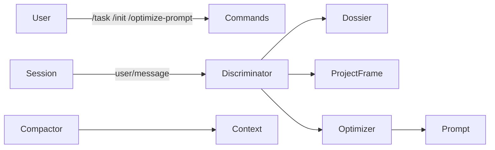

<div align="center">

# dsh-price-less

**Context management plugin for DeepSeek Harness**

> **Priceless thoughts. Price-less costs.**

[](LICENSE)
[]()
[]()
[]()

[English](./README.md) · [中文](./README.zh-CN.md)

</div>

---

## Table of Contents

- [About The Project](#about-the-project)
- [Features](#features)
- [Architecture](#architecture)
- [Getting Started](#getting-started)
  - [Prerequisites](#prerequisites)
  - [Installation](#installation)
- [Usage](#usage)
- [Configuration](#configuration)
- [Commands](#commands)
- [Session Events](#session-events)
- [Roadmap](#roadmap)
- [Contributing](#contributing)
- [License](#license)
- [Acknowledgments](#acknowledgments)

## About The Project

`dsh-price-less` is a non-official DeepSeek Harness plugin focused on context economy. It helps reduce token waste by:

- Establishing explicit task boundaries
- Initializing a project frame through user confirmation
- Automatically discriminating task continuation, new tasks, and message classes
- Providing a manual context section entry point
- Keeping all plugin facts replayable and fail-safe

> **Status**: Development. R2 discriminator phase is in progress.

## Features

- **Task boundaries**: `/task`, `/task close`, and `/task` status.
- **Project frame**: `/init` proposal → user confirmation → persisted `project_frame` v1.
- **Automatic discrimination**: T0 → L0 → table matching → LLM → fail-lazy chain.
- **Manual section**: `/optimize-prompt` entry point, shared with the future star button.
- **Replayable facts**: all `context-economy/*` events are log-only and `ignorable`.
- **Graceful degradation**: falls back to KV fact mirroring when the harness ignorable channel is unavailable.

## Architecture



```text
src/
├─ platform/    # Harness adapter layer, only external touchpoint
├─ core/        # Pure logic, zero harness imports
├─ domains/     # Command face, automatic discriminator, orchestration
└─ index.ts     # Plugin entry
client/         # Settings card and star button UI shell
docs/           # Design canon and implementation work orders
```

## Getting Started

### Prerequisites

- Node.js with ESM support
- A local DeepSeek Harness source checkout for building
- `dsh` CLI or `dev_inject_plugin` for loading the plugin

### Installation

```bash
# 1. Install dependencies
npm install --legacy-peer-deps --ignore-scripts --no-audit --no-fund --no-package-lock

# 2. Build from source (requires a local DSH checkout)
DSH_CHECKOUT=/path/to/deepseek-harness npm run build

# 3. Inject into a DSH instance
dev_inject_plugin /path/to/dsh-price-less
```

Planned distribution forms:

- npm: `dsh plugin add dsh-price-less`
- tarball: `dsh plugin add ./dsh-price-less-0.0.1.tgz`

## Usage

```text
/init I am building a context management plugin
/init confirm

/task Design the command face
/task
/task close
```

## Configuration

Configuration is currently grouped under `discriminator`.

| Key | Type | Default | Description |
|---|---|---|---|
| `discriminator.auto` | boolean | `false` | Master switch for automatic discrimination |
| `discriminator.provider` | string | `deepseek-official` | Auxiliary LLM provider |
| `discriminator.model` | string | `deepseek-v4-flash-vision-exp` | Auxiliary LLM model |

## Commands

| Command | Purpose |
|---|---|
| `/task <description>` | Explicitly open a new task |
| `/task close` | Explicitly close the current task |
| `/task` | Show current task status |
| `/init <goal>` | Start a project frame initialization proposal |
| `/init confirm` | Confirm and persist `project_frame` v1 |
| `/init cancel` | Cancel the current proposal |
| `/init` | Show current project frame |
| `/optimize-prompt` | Manual context section entry (available after P14b) |

## Session Events

All custom events are log-only and carry `ignorable: true`.

| Event | Meaning |
|---|---|
| `context-economy/task-boundary` | Task boundary fact |
| `context-economy/judge-recorded` | Automatic discrimination record |
| `context-economy/judge-error` | Discrimination failure record |
| `context-economy/judge-verdict` | New task verdict |

## Roadmap

| Phase | Scope | Status |
|---|---|---|
| R1 | Platform: events, storage, skills, LLM, history, tools | Completed |
| R2 | Discriminator: task boundaries, project frame, auto/manual sections | In progress |
| R3 | Shear domain | Planned |
| R4 | Compaction domain | Planned |

See [docs/implement/00-master.md](docs/implement/00-master.md) for detailed work orders.

## Contributing

Contributions are welcome. Before submitting a change, ensure:

```bash
npm run gate
```

passes completely.

## License

Distributed under the [BSD-3-Clause License](LICENSE).

## Acknowledgments

- [DeepSeek Harness](https://github.com/deepseek-ai/deepseek-harness)
- [Cordis](https://github.com/cordijs/cordis)
- Inspired by the context-economy design in `docs/`

> This project is not affiliated with DeepSeek.
