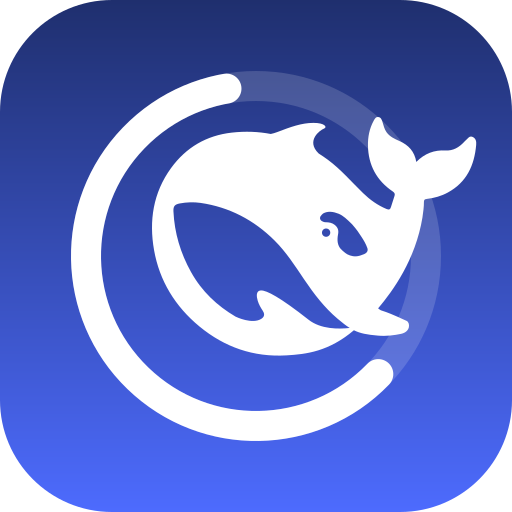
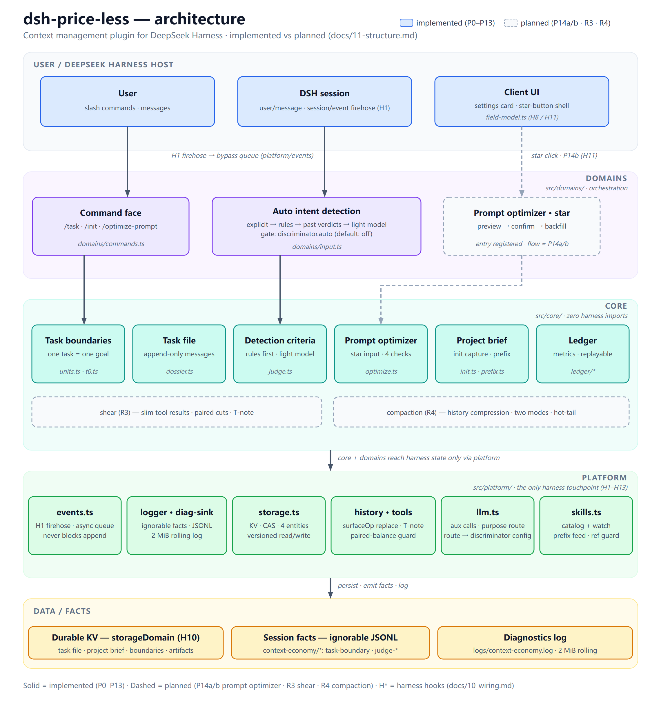

<div align="center">



# dsh-price-less

**Context management plugin for DeepSeek Harness**

> **Priceless thoughts. Price-less costs.**

[](LICENSE)
[]()
[]()
[]()

[English](./README.md) · [中文](./README.zh-CN.md)

</div>

---

## Table of Contents

- [About The Project](#about-the-project)
- [Current Status](#current-status)
- [Features](#features)
- [Architecture](#architecture)
- [Getting Started](#getting-started)
  - [Prerequisites](#prerequisites)
  - [Source Installation](#source-installation)
- [Usage](#usage)
- [Configuration](#configuration)
- [Commands](#commands)
- [Session Events](#session-events)
- [Documentation](#documentation)
- [Roadmap](#roadmap)
- [Known Limitations](#known-limitations)
- [Contributing](#contributing)
- [License](#license)
- [Acknowledgments](#acknowledgments)

## About The Project

Long AI-coding sessions get expensive — and drift. `dsh-price-less` is an unofficial **context steward** for DeepSeek Harness: it remembers what you are working on, tidies the context sent to the model — keeps what matters, drops what doesn't, and never touches anything it isn't sure about — so every token you send earns its place.

- **Explicit tasks**: `/task` tells the plugin what you are working on; opening and closing tasks is always your call
- **Project brief (project frame)**: `/init` asks a few questions and writes a project brief, so the model always knows what this project is
- **Intent detection**: decides whether each message continues the current task or starts a new one — keyword rules first, a light auxiliary model only when unsure
- **Prompt optimizer**: `/optimize-prompt` tidies the current prompt on demand; the coming star button shares the same entry
- **Log-only & replayable**: every plugin action leaves a replayable fact log; on any failure it changes nothing — your content is never lost

## Current Status

| Area | Status |
|---|---|
| R1 platform foundation (events, storage, logs, LLM calls) | Completed |
| R2 detection & optimizer core (P8–P13) | Completed |
| P14a/P14b prompt optimizer + star button | Not yet wired |
| R3 shear (slim tool results) / R4 compaction (history compression) | Planned |
| npm/tarball distribution | Not published yet |

> **Important**: automatic intent detection is **off by default**. Enable it explicitly with `discriminator.auto = true`. The `/optimize-prompt` command is registered, but the full prompt-optimizer flow arrives with P14b.

## Features

- **Task boundaries**: `/task`, `/task close`, `/task` status — split continuous work into clearly bounded tasks
- **Project brief**: `/init` proposal → your confirmation → persisted as project brief v1 (`project_frame`)
- **Intent detection**: your explicit instruction first, then zero-cost keyword rules, then past verdicts, and only then a light model — anything unresolved stays untouched (fail-lazy)
- **Prompt optimizer**: `/optimize-prompt` entry point, shared with the future star button
- **Replayable facts**: all `context-economy/*` events are log-only and `ignorable`
- **Graceful degradation**: if the harness lacks the ignorable channel, facts fall back to KV mirroring — still recorded, just stored elsewhere

## Architecture



The diagram shows the current implemented architecture with color-coded layers and clearly marks planned modules as dashed. How to read it in one line: you and the harness sit on top; `domains/` decides what to do, `core/` does the computing, `platform/` does the connecting — the bottom band is what gets recorded.

```text
src/
├─ platform/    # adapter layer — the plugin's only way to touch the harness
├─ core/        # pure logic — computation only, zero harness imports
├─ domains/     # orchestration — commands, intent detection, wiring
├─ config.ts    # config schema and defaults
├─ settings.ts  # settings UI wiring
└─ index.ts     # plugin entry
client/         # settings card and star-button UI
docs/           # design canon and work orders
```

## Getting Started

### Prerequisites

- Node.js with ESM support (Node 20+ recommended)
- A local DeepSeek Harness source checkout for building
- `dsh` CLI or `dev_inject_plugin` for loading the plugin

### Source Installation

This is currently a **source-build / developer installation**. There is no published npm package or tarball distribution yet.

```bash
# 1. Install dependencies
npm install --legacy-peer-deps --ignore-scripts --no-audit --no-fund --no-package-lock

# 2. Build from source (requires a local DSH checkout)
DSH_CHECKOUT=/path/to/deepseek-harness npm run build

# 3. Inject into a DSH instance
dev_inject_plugin /path/to/dsh-price-less
```

Planned distribution forms (not available yet):

- npm: `dsh plugin add dsh-price-less`
- tarball: `dsh plugin add ./dsh-price-less-0.0.1.tgz`

## Usage

```text
/init I am building a context management plugin
/init confirm

/task Design the command face
/task
/task close
```

## Configuration

Configuration is currently grouped under `discriminator`.

| Key | Type | Schema default | Description |
|---|---|---|---|
| `discriminator.auto` | boolean | `false` | Master switch for automatic intent detection |
| `discriminator.provider` | string | unset | Auxiliary LLM provider; when set together with `model`, overrides the built-in preset |
| `discriminator.model` | string | unset | Auxiliary LLM model; when set together with `provider`, overrides the built-in preset |

> The schema declares no default for `provider`/`model`. Left empty, auxiliary calls (intent detection, `/init`, star section) first **follow the current session model** (provider/model of the latest request), falling back to the built-in default `deepseek-official` / `deepseek-v4.1-flash-expires-on-0910` when the session has no request yet; setting **both** values overrides it. Enabling `discriminator.auto` or using `/init` may invoke the auxiliary LLM. This can incur API costs and may send relevant prompt content to the configured provider.

## Commands

| Command | Purpose |
|---|---|
| `/task <description>` | Explicitly open a new task |
| `/task close` | Close the current task |
| `/task` | Show current task status |
| `/init <goal>` | Start a project brief proposal |
| `/init confirm` | Confirm and persist the project brief v1 (`project_frame`) |
| `/init cancel` | Cancel the current proposal |
| `/init` | Show the current project brief |
| `/optimize-prompt` | Prompt optimizer entry; full flow pending P14b |

## Session Events

All currently emitted custom events are log-only and carry `ignorable: true`.

| Event | Meaning |
|---|---|
| `context-economy/task-boundary` | Task boundary fact (which task opened / closed) |
| `context-economy/judge-recorded` | One complete intent-detection record |
| `context-economy/judge-error` | One failed detection record |
| `context-economy/judge-verdict` | The verdict: new task or not |

## Documentation

The design canon is maintained under [`docs/`](docs/):

- [00 · System overview](docs/00-overview.md)
- [01 · Architecture](docs/01-architecture.md)
- [02 · Discriminator](docs/02-discriminator.md)
- [03 · Shear](docs/03-shear.md)
- [04 · Compactor](docs/04-compactor.md)
- [05 · Constitution](docs/05-constitution.md)
- [06 · Cache](docs/06-cache.md)
- [07 · Metrics](docs/07-metrics.md)
- [09 · State](docs/09-state.md)
- [10 · Wiring](docs/10-wiring.md)
- [11 · Structure](docs/11-structure.md)
- [12 · Platform capabilities](docs/12-platform-capabilities.md)
- [13 · Harness plugin spec](docs/13-harness-plugin-spec.md)
- [Implementation master plan](docs/implement/archive/00-master.md)

## Roadmap

| Phase | Scope | Status |
|---|---|---|
| R1 | Platform foundation: events, storage, skills, LLM, history, tools | Completed |
| R2 | Detection: task boundaries, project brief, intent detection & prompt optimizer | P8–P13 done; P14 pending |
| R3 | Shear: slim tool results | Planned |
| R4 | Compaction: history compression | Planned |

See [docs/implement/archive/00-master.md](docs/implement/archive/00-master.md) for detailed work orders.

## Known Limitations

- **Not published**: the package is still marked `private` and there is no official npm/tarball release.
- **Intent detection is opt-in**: `discriminator.auto` defaults to `false` to avoid unexpected auxiliary LLM costs.
- **Prompt optimizer is incomplete**: `/optimize-prompt` is only an entry point; the full star-button flow depends on P14b.
- **R3/R4 not implemented**: shear (slimming tool results) and compaction (history compression) are designed but not yet available.
- **Local checkout required**: building currently requires a local DeepSeek Harness source checkout and `dev_inject_plugin`.
- **Ignorable-channel dependency**: if the host harness does not include the local ignorable channel, plugin facts are mirrored to KV instead of being written as session events. Replay and observability may be reduced until the upstream channel is merged.
- **LLM calls**: enabling intent detection or using `/init` may send content to the configured auxiliary LLM and incur costs.
- **Non-affiliation**: this project is not affiliated with DeepSeek.

## Contributing

Contributions are welcome. Before submitting a change, ensure:

```bash
npm run gate
```

passes completely.

When changing documentation, please update both `README.md` and `README.zh-CN.md` together.

## License

Distributed under the [MIT License](LICENSE).

## Acknowledgments

- [DeepSeek Harness](https://github.com/deepseek-ai/deepseek-harness)
- [Cordis](https://github.com/cordijs/cordis)
- Inspired by the context-economy design in `docs/`

> This project is not affiliated with DeepSeek.
