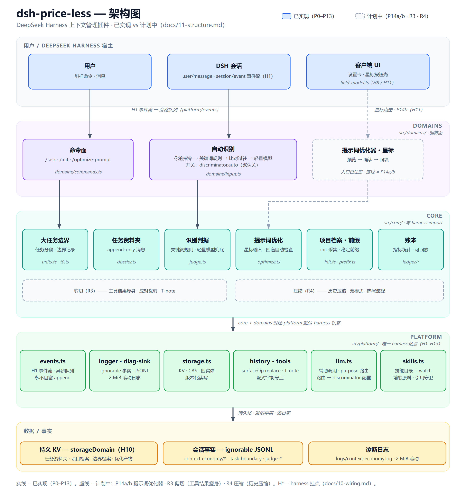

<div align="center">


# dsh-price-less

**DeepSeek Harness 上下文管理插件**

> **留下无价的想法，省去有价的过程。**

[](LICENSE)
[]()
[]()
[]()

[English](./README.md) · [中文](./README.zh-CN.md)

</div>

---

## 目录

- [项目介绍](#项目介绍)
- [它是怎么工作的](#它是怎么工作的)
- [当前状态](#当前状态)
- [核心特性](#核心特性)
- [架构](#架构)
  - [分层职责](#分层职责)
  - [关键机制与真机修正](#关键机制与真机修正)
- [快速开始](#快速开始)
  - [环境要求](#环境要求)
  - [源码安装](#源码安装)
- [使用](#使用)
- [配置](#配置)
- [命令](#命令)
- [会话事实](#会话事实)
- [文档](#文档)
- [路线图](#路线图)
- [已知限制](#已知限制)
- [贡献](#贡献)
- [许可证](#许可证)
- [致谢](#致谢)

## 项目介绍

AI 编程会话越长越贵，也越容易跑偏。`dsh-price-less` 是非官方的 DeepSeek Harness **上下文管家**：它替你记住“现在在干嘛”，把送进模型的上下文整理得更瘦，拿不准的绝不动刀——让每个 token 都花在刀刃上。

- **显式大任务（task）**：`/task` 一句话告诉插件现在在干嘛；开新任务、收尾旧任务，始终由你拍板
- **项目档案（project frame）**：`/init` 一问一答生成项目背景卡，模型始终带着“这是个什么项目”干活
- **自动识别**：判断每条消息是延续当前大任务，还是开了新的大任务——先关键词规则，拿不准才请轻量模型
- **星标按钮 / 提示词优化器**：一键把当前意图整理成确定化的执行包，先给你预览、确认后才生效
- **工具剪切**：写时整形工具输出、剪掉被后续写入超越的旧读、冲刷已经结束的追问/验证 run
- **压缩器**：把闭合的 task 折叠进带热尾的版本化档案，另有 35% 窗口压力路径与防溢出保险丝
- **只记账、可回放**：插件每个动作都留下可回放的事实日志；任何失败都“不动刀”，绝不弄丢你的内容

## 它是怎么工作的

一句话：**你只管说“现在在干嘛”，插件负责把上下文整理瘦；拿不准的，一律不动刀。**

四层防御按“什么时候动手”从早到晚排开：


| 层 | 什么时候动手 | 动什么 | 绝不动什么 |
|---|---|---|---|
| ① 写时整形 | 工具结果**入账前** | 只整形“过程日志”（≥120 行且 ≥16 KiB） | 失败信息、列表、数据查询一律原文 |
| ② 交换对剪切 | task 进行中 | 被后续写入覆盖的旧读、声明表读件、已结束的追问/验证 run | 结论会落成一条通知，原始结论不丢 |
| ③ 压缩 | task 闭合，或主模型窗口用到 35% | 把旧内容折成“档案（总分）+ 热尾（最近逐字事实）” | 错误不进热尾；档案只存总分，不存指针 |
| ④ 恢复 | 会话重启 / resume | 重放卷宗与档案，用纯函数重算状态 | 不调模型、不改历史、只降级不臆造 |

三条底线贯穿全部四层：

- **失败方向 = 保留**：判据不成立、解析失败、超时 → 不剪、不替换、不回填。
- **剪点必须在结果入账前定死**：不依赖模型回应，也不用行为信号（那会打断缓存、反而更贵）。
- **带外原则**：插件内部标志永远不进模型视野，模型只看到整理后的内容。

> 想看每次动作花了什么，读 `logs/context-economy.log`；想复盘历史账本，见 [`docs/ledger-history.md`](docs/ledger-history.md)。

## 当前状态

| 区域 | 状态 |
|---|---|
| R1 平台底座（事件、存储、技能目录、模型调用、历史改写、工具） | 已完成 |
| R2 识别与优化核心（P8–P14d：大任务边界、项目档案、自动识别、提示词优化器、星标按钮） | 已完成 |
| R3 剪切（写时整形、T0/T0-R、run 冲刷） | 已完成 |
| R4 压缩（边界装配、热尾、压力路径、保险丝、恢复编排） | 已完成 |
| 新构建生效 | 需要重启 DSH 加载重新构建的 `lib/` |
| npm / tarball 发布 | 尚未发布 |

> **重要**：自动识别默认**关闭**，需要显式设置 `discriminator.auto = true` 才会启用。工具剪切（`shear.enabled`）与两条压缩路径默认开启。所有事实只记账；任何失败都不改动内容。

## 核心特性

- **大任务边界**：`/task`、`/task close`、`/task`——把连续的工作切成一段段边界清晰的大任务
- **项目档案**：`/init` 提案 → 你确认 → 写入项目档案 v1（`project_frame`）
- **自动识别**：显式指令 → 零成本关键词规则 → 比对过往判定 → 轻量模型兜底；任何一步拿不准就保持原样（fail-lazy）
- **提示词优化器 + 星标按钮**：`/optimize-prompt` 与星标按钮共用同一断面；产物 = 关键事实逐字保留 + 大胆重写，先预览后生效
- **工具剪切**：写时整形（只碰过程日志）、被写超越的旧读、声明表读件修复、结束的追问/验证 run 冲刷
- **压缩器**：task 边界折叠进版本化档案 + 热尾；35% 窗口压力路径；防溢出保险丝；会话启动恢复
- **工作区隔离**：档案/前缀键按会话工作区（`header.cwd`）隔离
- **只记账、可回放**：`context-economy/*` 事件全部 log-only、`ignorable`；通道缺失时自动降级为 KV 事实镜像

## 架构



> 图源 = [`docs/architecture.zh-CN.svg`](docs/architecture.zh-CN.svg)（英文版 [`architecture.svg`](docs/architecture.svg)）。实线 = 已实现；虚线 = 待验证方向。图上每个盒子就近标注了对应的修正编号。

### 分层职责

从上往下是一条数据流，从下往上是“谁听谁”的约束：

| 层 | 人话 | 正典词 | 规矩 |
|---|---|---|---|
| 顶部 | 你和 harness | 宿主 | 事件流从会话进入插件 |
| `domains/` | 决定**做什么** | 编排面 | 命令、自动识别、剪切/压缩/恢复的流程串接 |
| `core/` | 决定**怎么算** | 纯核 | **零 harness import**，只做计算，可单测 |
| `platform/` | 决定**怎么连** | 适配层 | 唯一 harness 触点（H1–H15），换宿主只改这一层 |
| 底部 | 留下了什么 | 数据 / 事实 | 持久 KV + 会话事实 + 诊断日志，全部可回放 |

```text
src/
├─ platform/    # 适配层：插件与 harness 打交道的唯一出口
├─ core/        # 纯逻辑：只做计算，不依赖 harness
├─ domains/     # 编排层：命令、自动识别、流程串接
├─ config.ts    # 配置项与默认值
├─ settings.ts  # 设置界面接线
└─ index.ts     # 插件入口
client/         # 设置卡片与星标按钮界面
docs/           # 设计文档与施工工单
```

### 关键机制与真机修正

下面每一条都已落进代码与账本，图上按机制就近标注：

| 修正 | 内容 | 账本 |
|---|---|---|
| F1 | 工具端口必须 `ctx.inject(['tools'])` 后经回调传入，否则剪切整体空转 | §60 |
| F2 | 边界压缩前加 60s 判词屏障，避免新任务背着旧任务上下文开跑 | §60 |
| F3 | 工作区隔离：档案/前缀键唯一键源 = 会话 `header.cwd` | §70 |
| F4 / F5a | 诊断日志去重；档案渲染结论先行 + 类型标签 | §60 |
| F8a / F8b | 估计器对齐 DSH `token-meter`，两桶密度（CJK 1.5 / 其余 2.9 字符/token） | §61 |
| F9a–F9g | 区间取自权威表面、产物 schema v2、热尾事实载体、双预算 10K/10K、路径相对化 | §62–§68 |
| F10 | 契约 v3：总分零指针、热尾指向档案、档案只存总分、错误不进热尾 | §69 |
| F11 | 列表类命令（`Get-ChildItem` / `ls` / `dir` …）一律不剪 | §70 |
| F12 | 影子模式零字节：只记事实，绝不往正文写注记 | §70 |
| F13 | 判别器 v4：task = 对同一工作对象 / 类似目标的持续改进；子task 不分流 | §70 |
| P14c / P14d | 判别链瘦身；★ 断面产品契约（关键事实保真 + 大胆重写、禁标签、同 prompt 二次点击只展开） | §33 / §35–§37 |
| P17c | 装配 HT 软门 + 丢弃归因 | §44 |
| P20c | 压力阀门 = `pressureRatio`(0.35) × 主模型窗口；缺窗口 → 125K → 安全网 100K | §48 |
| W2 | T-entry 准入收紧为“过程日志白名单”，失败 / 列表 / 数据查询原文保留 | §73 |
| N 系列 / T-loop | 协商剪除与工具思考后截断**整体退役**（真机 0 命中 / 缓存断裂） | §71 / §72 |

## 快速开始

### 环境要求

- 支持 ESM 的 Node.js（建议 Node 20+）
- 本地 DeepSeek Harness 源码仓库（用于构建）
- `dsh` CLI 或 `dev_inject_plugin`（用于加载插件）

### 源码安装

当前只有**源码构建 / 开发者安装**方式，还没有发布 npm 包或 tarball。

```bash
# 1. 安装依赖
npm install --legacy-peer-deps --ignore-scripts --no-audit --no-fund --no-package-lock

# 2. 从源码构建（需要本地 DSH checkout）
DSH_CHECKOUT=/path/to/deepseek-harness npm run build

# 3. 注入到 DSH 实例
dev_inject_plugin /path/to/dsh-price-less
```

计划中的发布形态（当前不可用）：

- npm：`dsh plugin add dsh-price-less`
- tarball：`dsh plugin add ./dsh-price-less-0.0.1.tgz`

## 使用

```text
/init 我要做一个上下文管理插件
/init confirm

/task 设计命令面
/task
/task close

/optimize-prompt
```

- `/init` 只是提案，`/init confirm` 才写入项目档案；随时 `/init cancel` 取消。
- `/task` 开新任务；之后的消息由自动识别（若开启）判断是延续还是新任务；`/task close` 标记收尾，边界压缩据此触发。
- `/optimize-prompt` 或星标按钮先弹预览：确认后才回填，你编辑过的版本即终稿。
- 任何一步失败都不会改动内容——最坏情况是什么也没发生。

## 配置

配置分组：`shear`（工具剪切）、`compression`（压缩）、`discriminator`（自动识别 / 辅助模型）。可在 GUI 设置卡片里改，也可以直接写 `~/.dsh/settings.yaml`：

```yaml
context-economy:
  shear:
    enabled: true
  compression:
    boundary: true
    pressure: true
    pressureRatio: 0.35      # 压力阀门 = 比例 × 主模型上下文窗口
    domainTokens: 125000     # 主模型未声明窗口时的假定窗口
    retainTokens: 10000      # 热尾预算
    thresholdTokens: 100000  # 末位绝对安全网
    archiveCapTokens: 10000  # 档案区硬帽（只计总分）
  discriminator:
    auto: false              # 自动识别默认关闭
    # provider: deepseek-official
    # model: deepseek-v4.1-flash-expires-on-0910
    # reasoningEffort: high
```

| 配置 | 类型 | 默认值 | 说明 |
|---|---|---|---|
| `shear.enabled` | boolean | `true` | 工具剪切总开关 |
| `compression.boundary` | boolean | `true` | task 边界压缩 |
| `compression.pressure` | boolean | `true` | 压力路径压缩 |
| `compression.pressureRatio` | number | `0.35` | 压力阀门 = 比例 × 主模型上下文窗口 |
| `compression.domainTokens` | number | `125000` | 主模型未声明窗口时的假定窗口 |
| `compression.retainTokens` | number | `10000` | 热尾预算 |
| `compression.thresholdTokens` | number | `100000` | 末位绝对安全网 |
| `compression.archiveCapTokens` | number | `10000` | 档案区硬帽（只计总分） |
| `discriminator.auto` | boolean | `false` | 自动识别总开关 |
| `discriminator.provider` / `model` | string | 未设置 | 辅助模型路由；两项都设置时覆盖，留空则跟随会话模型 |
| `discriminator.reasoningEffort` | string | 未设置 | 辅助调用推理档；未设置 = 跟随模型默认 |

> schema 未给 `provider` / `model` 声明默认值。留空时，辅助调用（自动识别、`/init`、星标断面、边界压缩）优先**跟随当前会话模型**（最近一次请求的 provider/model），无请求记录时回落内置默认 `deepseek-official` / `deepseek-v4.1-flash-expires-on-0910`；两项**都**填写时以配置为准。开启 `discriminator.auto` 或使用 `/init`、星标按钮、边界压缩可能会调用辅助模型，产生 API 费用，并可能把相关提示词内容发送给所配置的服务商。

## 命令

| 命令 | 作用 |
|---|---|
| `/task <描述>` | 显式开启一个新大任务 |
| `/task close` | 收尾当前大任务 |
| `/task` | 查看当前大任务状态 |
| `/init <项目目标>` | 发起项目档案初始化提案 |
| `/init confirm` | 确认并写入项目档案 v1（`project_frame`） |
| `/init cancel` | 取消当前提案 |
| `/init` | 查看当前项目档案 |
| `/optimize-prompt` | 命令形态的提示词优化器入口（星标按钮是主界面） |

## 会话事实

当前已发射的自定义事件均为只记账（log-only），并携带 `ignorable: true`。

| 事件 | 含义 |
|---|---|
| `context-economy/task-boundary` | 大任务边界事实（开了 / 关了哪个任务） |
| `context-economy/judge-recorded` / `judge-error` / `judge-verdict` | 自动识别记录与结论 |
| `context-economy/optimize-run` | 星标断面全账 |
| `context-economy/shear-applied` / `shear-decision` / `shear-error` / `shear-run-plan` | 剪切落刀、裁决、失败、星标剪切清单 |
| `context-economy/assemble-run` | 边界装配账 |
| `context-economy/compress-run` | 压缩调用账 |
| `context-economy/pressure-fired` / `hard-truncate` | 压力触发 / 防溢出保险丝 |
| `context-economy/restore-step` / `restore-degraded` / `restore-done` | 会话启动恢复编排 |

## 文档

设计正典维护在 [`docs/`](docs/) 下：

- [00 · 系统导览](docs/00-overview.md)
- [01 · 架构](docs/01-architecture.md)
- [02 · 判别器](docs/02-discriminator.md)
- [03 · 剪切层](docs/03-shear.md)
- [04 · 压缩器](docs/04-compactor.md)
- [05 · 宪法](docs/05-constitution.md)
- [06 · 缓存](docs/06-cache.md)
- [07 · 度量](docs/07-metrics.md)
- [08 · 实验协议（已封存）](docs/08-experiment.md)
- [09 · 状态](docs/09-state.md)
- [10 · 挂点](docs/10-wiring.md)
- [11 · 工程结构](docs/11-structure.md)
- [12 · 平台能力](docs/12-platform-capabilities.md)
- [13 · DSH 插件规范](docs/13-harness-plugin-spec.md)
- [legacy · 退役设计存档](docs/legacy.md)
- [TODO · 待验证方向](docs/implement/TODO.md)
- [ledger-history · 账本快照存档](docs/ledger-history.md)

> `docs/implement/archive/` 里的 R1–R4 工单与其余退役文档为**本地只读**（`.gitignore` 排除，全文保留在 git 历史）；其中两份研究记录已入库：[W2c 形态解析评估](docs/implement/archive/W2c-output-shape.md) 与 [N 系列总纲](docs/implement/archive/00-master-N-series.md)。

## 路线图

| 阶段 | 范围 | 状态 |
|---|---|---|
| R1 | 平台底座：事件、存储、技能目录、模型调用、历史改写、工具 | 已完成 |
| R2 | 识别与优化：大任务边界、项目档案、自动识别、提示词优化器、星标按钮 | 已完成 |
| R3 | 剪切：工具结果瘦身、被超越旧读、run 冲刷 | 已完成 |
| R4 | 压缩：边界装配、压力路径、保险丝、恢复编排 | 已完成 |
| B 系列 | 分支-合并上下文（checkout/merge）——空间换效率 | 待验证 —— [TODO §3](docs/implement/TODO.md) |
| R 系列 | 思考回放剪除 | 待验证 —— [TODO §3](docs/implement/TODO.md) |

## 已知限制

- **尚未发布**：`package.json` 仍标记为 `private`，暂无官方 npm/tarball 发布。
- **重新构建后需重启**：机制在下次重启时加载新的 `lib/`。
- **自动识别默认关闭**：`discriminator.auto` 默认为 `false`，避免产生非预期的辅助模型费用。
- **辅助模型调用可能产生费用**：开启自动识别、使用 `/init`、星标按钮或边界压缩，都可能把内容发送给所配置的服务商。
- **依赖 ignorable 通道**：如果宿主 harness 未包含本地 ignorable 通道，插件事实会降级到 KV 镜像，而不是写入会话事件；在上游通道合并前，回放和可观测性可能受限。
- **档案文档多为本地**：`docs/implement/archive/` 默认被 `.gitignore` 排除（全文保留在 git 历史）；仅 `W2c-output-shape.md` 与 `00-master-N-series.md` 两份研究记录入库。
- **需要本地 checkout**：当前构建需要本地 DeepSeek Harness 源码仓库和 `dev_inject_plugin`。
- **非隶属关系**：本项目与 DeepSeek 无隶属关系。

## 贡献

欢迎提交 Issue 与 PR。提交前请确保：

```bash
npm run gate
```

全绿。

修改文档时，请同步更新 `README.md` 和 `README.zh-CN.md`。

## 许可证

[MIT](LICENSE)

## 致谢

- [DeepSeek Harness](https://github.com/deepseek-ai/deepseek-harness)
- [Cordis](https://github.com/cordijs/cordis)
- 灵感来自 `docs/` 中的上下文经济设计

> 本项目与 DeepSeek 无隶属关系。
