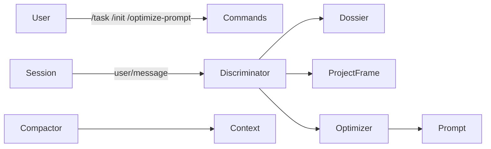

<div align="center">

# dsh-context-economy

**DeepSeek Harness 上下文管理插件**

[](LICENSE)
[]()
[]()
[]()

[English](./README.md) · [中文](./README.zh-CN.md)

</div>

---

## 目录

- [项目介绍](#项目介绍)
- [核心特性](#核心特性)
- [架构](#架构)
- [快速开始](#快速开始)
  - [环境要求](#环境要求)
  - [安装](#安装)
- [使用](#使用)
- [配置](#配置)
- [命令](#命令)
- [会话事实](#会话事实)
- [路线图](#路线图)
- [贡献](#贡献)
- [许可证](#许可证)
- [致谢](#致谢)

## 项目介绍

`dsh-context-economy` 是非官方的 DeepSeek Harness 上下文管理插件，致力于让“送进模型的每个 token”更有价值：

- 建立显式任务边界
- 通过用户确认初始化项目帧
- 自动判别任务延续、新任务与消息类型
- 提供手动断面入口
- 所有插件事实可回放、可降级

> **状态**：开发中。当前处于 R2 判别域阶段。

## 核心特性

- **任务边界**：`/task`、`/task close`、`/task` 状态查看
- **项目帧**：`/init` 提案 → 用户确认 → 持久化 `project_frame` v1
- **自动判别**：T0 → L0 → 对表 → LLM → fail-lazy 决策链
- **手动断面**：`/optimize-prompt` 入口，后续与星标按钮共用
- **事实可回放**：`context-economy/*` 事件全部 log-only + ignorable
- **优雅降级**：harness 缺少 ignorable 通道时降级为 KV 事实镜像

## 架构



```text
src/
├─ platform/    # harness 适配层，唯一外部触点
├─ core/        # 纯逻辑，零 harness import
├─ domains/     # 命令面、自动断面、编排
└─ index.ts     # 插件入口
client/         # 设置卡与星标按钮 UI 壳
docs/           # 设计正典与施工工单
```

## 快速开始

### 环境要求

- 支持 ESM 的 Node.js
- 本地 DeepSeek Harness source checkout（用于构建）
- `dsh` CLI 或 `dev_inject_plugin`（用于加载插件）

### 安装

```bash
# 1. 安装依赖
npm install --legacy-peer-deps --ignore-scripts --no-audit --no-fund --no-package-lock

# 2. 从源码构建（需要本地 DSH checkout）
DSH_CHECKOUT=/path/to/deepseek-harness npm run build

# 3. 注入到 DSH 实例
dev_inject_plugin /path/to/dsh-context-economy
```

计划中的发布形态：

- npm：`dsh plugin add dsh-context-economy`
- tarball：`dsh plugin add ./dsh-context-economy-0.0.1.tgz`

## 使用

```text
/init 我要做一个上下文管理插件
/init confirm

/task 设计命令面
/task
/task close
```

## 配置

当前配置集中在 `discriminator` 命名空间。

| 配置 | 类型 | 默认值 | 说明 |
|---|---|---|---|
| `discriminator.auto` | boolean | `false` | 自动断面总开关 |
| `discriminator.provider` | string | `deepseek-official` | 辅助 LLM provider |
| `discriminator.model` | string | `deepseek-v4-flash-vision-exp` | 辅助 LLM 模型 |

## 命令

| 命令 | 作用 |
|---|---|
| `/task <描述>` | 显式开启新任务 |
| `/task close` | 显式闭合当前任务 |
| `/task` | 查看当前任务状态 |
| `/init <项目目标>` | 发起项目帧初始化提案 |
| `/init confirm` | 确认并写入 `project_frame` v1 |
| `/init cancel` | 取消当前提案 |
| `/init` | 查看当前项目帧 |
| `/optimize-prompt` | 手动断面入口（P14b 接入后可用） |

## 会话事实

所有自定义事件均为 log-only，并携带 `ignorable: true`。

| 事件 | 含义 |
|---|---|
| `context-economy/task-boundary` | 任务边界事实 |
| `context-economy/judge-recorded` | 自动判别记录 |
| `context-economy/judge-error` | 判别失败记录 |
| `context-economy/judge-verdict` | 新任务判定 |

## 路线图

| 阶段 | 范围 | 状态 |
|---|---|---|
| R1 | 平台面：事件、存储、技能、LLM、历史、工具 | 已完成 |
| R2 | 判别域：任务边界、项目帧、自动/手动断面 | 进行中 |
| R3 | 剪切域 | 计划中 |
| R4 | 压缩域 | 计划中 |

详细工单见 [docs/implement/00-master.md](docs/implement/00-master.md)。

## 贡献

欢迎提交 Issue 与 PR。提交前请确保：

```bash
npm run gate
```

全绿。

## 许可证

[BSD-3-Clause](LICENSE)

## 致谢

- [DeepSeek Harness](https://github.com/deepseek-ai/deepseek-harness)
- [Cordis](https://github.com/cordijs/cordis)
- 灵感来自 `docs/` 中的上下文经济设计

> 本项目与 DeepSeek 无隶属关系。
